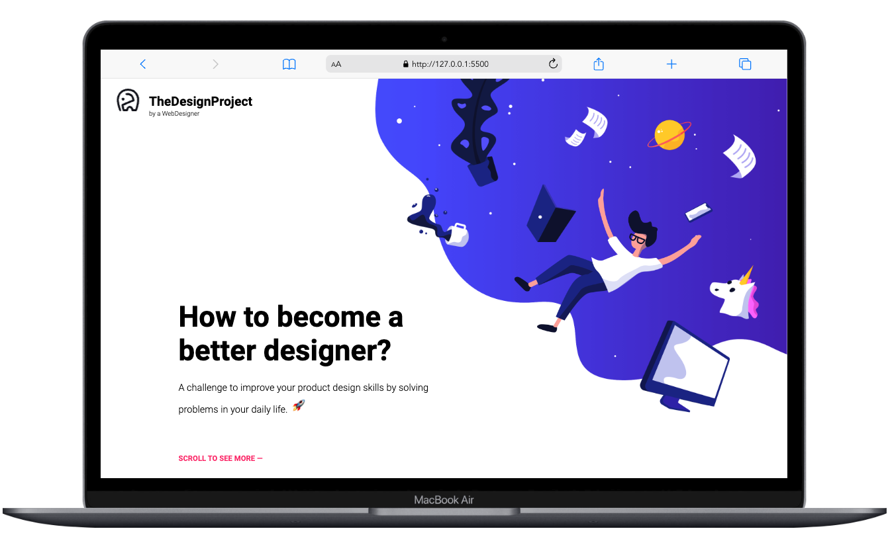
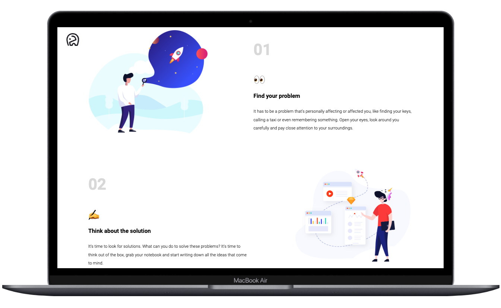
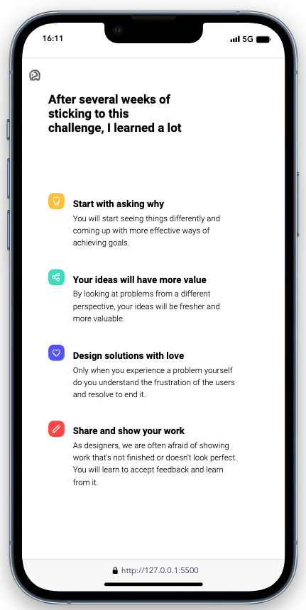
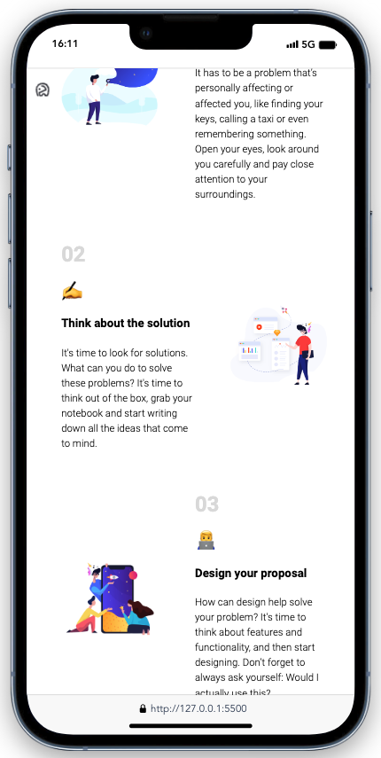

# Designer Challenge Responsive Website

## Stack & Tools

## Preview

<table>
<tbody>

<!--# 1. Reihe  ---------- -->
<tr>

<td align="center">

</td>

</tr>

<!--# 2. Reihe  ---------- -->
<tr>

<td align="center">

</td>

</tr>

<!--# 3. Reihe  ---------- -->
<tr>

<td align="center">

</td>

</tr>

</tbody>
</table>
